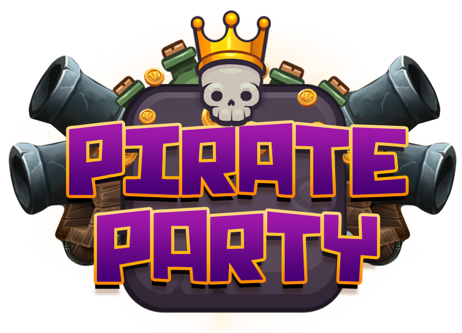

# Impportant Information, Read Me!
Please follow this link to view the actual Github repository where this project's code is hosted. Thanks for viewing our project!
* [Pirate Party Repository](https://github.com/L-Figgins13/ThePirateParty)

# MERN Pirate Party
[](http://hits.dwyl.com/{L-Figgins13}/{Genesis})
[](https://github.com/dwyl/goodparts "JavaScript The Good Parts")
[](http://nodejs.org/download/)
[](https://travis-ci.org/{L-Figgins13}/{Genesis})
[](http://makeapullrequest.com)

**Pirate Party** is an **Isometric JavaScript Application** utilizing the **MERN** technology stack: **(MongoDB, Express, React, Node)**.

These instructions will get you a copy of the project up and running on your local machine for development and testing purposes. See "Play The Game" for notes on how to just play the game.

* [Website](www.pirateparty.github.io)
* [Documentation](www.pirateparty.io/documentation)
* [Discussions](www.pirateparty.github.io/forum)

### In-Game Screenshots
<p align="center">
   
</p>

### RoadMap

**Planned Features:**
- Main Game Component (Releasing Shortly)
- Cross Platform App (iOS, Android, PC)
- New Characters and Avatar States
- Player Skills & Abilities
- Player Experience


**Exisiting Features:**
- User Authentication
- User Profile with Selectable Character Avatar
- Socket.io Chat
- Audio Components
- Game Animations
- Game Lobby with Chat Component
- Ability to Enter User Created Games

### Play The Game
After the main game component finishes development the game will be available to test on a Heroku link which will be posted for user testing purposes. The final release of the game will come at a later date TBA.


### Installing for Development
If you would like to contribute to Pirate Party install the zipped source file and complete the following steps.

1. ```npm install -g mern-genesis```

2. ```genesis init my_app_name```

3. ```cd my_app_name```

4. ```npm install```

5. ```npm run watch-server```

6. ```npm run watch```

7. ```npm start```


**Note :** Please make sure your MongoDB database is up and running first. For MongoDB installation guide, please reference this MongoDB
[installation guide](https://docs.mongodb.org/v3.0/installation/).


### Available Development Commands

```
   - npm run watch-server -  starts the server with nodemon watching.
   - npm run watch - starts watching full project.
   - npm start - starts development app at localhost:3000, server at localhost:8000.

```

**Webpack Configs**

MERN GENESIS uses Webpack for bundling modules. There are four types of Webpack configs provided:
 - **webpack.config.js** for development
 - **webpack.config.server.js** for bundling server in production


**Server**

MERN GENESIS uses express web framework. Our app sits in server.js where we check for NODE_ENV.
If NODE_ENV is development, we apply Webpack middlewares for bundling and Hot Module Replacement.

## Built With
* [MongoDB]( https://www.mongodb.com/) - NoSQL Database
* [Express]( https://expressjs.com/) - Server Middleware
* [React](https://reactjs.org/) - Front End Web Technology
* [NodeJS]( https://nodejs.org/en/) - Npm and General Project Structure
* [Socket.io]( https://www.socket.io) - Real-Time Events
* [Styled Components](https://github.com/styled-components/styled-components) - General Component Styling
* [Swagger Ui](https://swagger.io/) - API documentation

## Contributing 
[](https://github.com/dwyl/esta/issues)
Please read [CONTRIBUTING.md](https://gist.github.com/PurpleBooth/b24679402957c63ec426) for details on our code of conduct, and the process for submitting pull requests to us.

## Authors
* **Logan Figgins** - *Designer & Developer* - @github/L-Figgins13 - [Pirate Party](https://github.com/L-Figgins13)
* **Zack Watkins** - *Designer & Developer* - @github/TheByteForge - [Pirate Party](https://github.com/TheByteForge)

## License
This project is licensed under the MIT License - see the [LICENSE.md](LICENSE.md) file for details
